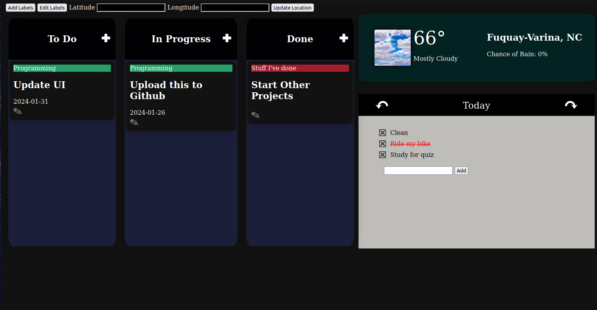

# kanvvan
Kanban board editor with a notepad for todo-lists and weather updates.



## Setup
1. Clone this repository into a folder.
2. Create a [virtual environment](https://docs.python.org/3/library/venv.html).
3. Activate your virtual environment and install Flask and requests.
   
     ```pip install Flask
     pip install requests
     ```
5. Initialize the database.

    ```flask --app kanvvan init-db```
6. Start up the site

   ```flask --app kanvvan run```
7. Point your browser to [http://127.0.0.1:5000](http://127.0.0.1:5000)

## How to Use
### Kanban Cards
To <b>create a card</b>, click the "+" icon next to one of the boards to add a card the board.

You can <b>move</b> the card between boards by dragging and dropping the card between boards.

You can <b>edit or delete your cards</b> by clicking the pencil button on a card.

<b>Add label</b> with different names and colors by clicking the "Add Labels" button at the top.

<b>Edit labels</b> by clicking the edit labels button at the top.

### Weather
To update your location, determine your latitude and longitude from google maps ([how to find your latitutde and longitude](https://support.google.com/maps/answer/18539?hl=en&co=GENIE.Platform%3DDesktop) and enter in the appropiate text boxes at the top of the page. Reload the page to view your changes.

### To-Do List Notepad
Switch between days by clicking the arrows at the top of the notepad.

<b>Add todo items</b> by entering them into the add box.

<b>Cross out items</b> by clicking the task you've finished.

<b>Delete items</b> by pressing the "X" next to your item.

